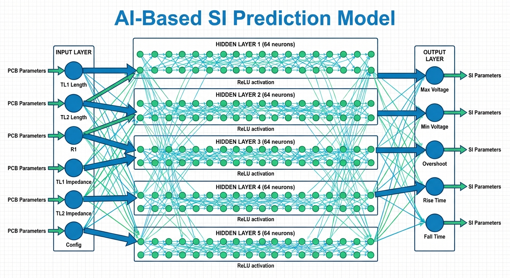

# AI-Based Signal Integrity Compliant PCB Design

[](https://www.python.org/)
[](https://www.tensorflow.org/)
[](LICENSE)
[](https://jupyter.org/)
[](https://github.com/psf/black)
[](https://github.com/thiyanayugi/AI-Based-SI-Compliant-PCB-Design/graphs/commit-activity)

A machine learning approach to predicting Signal Integrity (SI) parameters in Printed Circuit Board (PCB) design using neural networks.

## Table of Contents

- [Overview](#overview)
- [Background](#background)
- [Architecture](#architecture)
- [Project Structure](#project-structure)
- [Neural Network Architecture](#neural-network-architecture)
- [Dataset](#dataset)
- [Installation](#installation)
- [Usage](#usage)
- [Technologies Used](#technologies-used)
- [Authors](#authors)
- [Contact](#contact)


## Overview

This project implements deep learning models to predict critical Signal Integrity parameters for PCB transmission lines. By training neural networks on simulation data, we can rapidly predict SI characteristics without running time-consuming electromagnetic simulations.

## Background

Signal Integrity is crucial in high-speed PCB design. Traditional SI analysis requires electromagnetic field simulations which are computationally expensive. This project demonstrates how neural networks can learn the relationship between PCB design parameters and SI outcomes, enabling:

- **Rapid SI prediction** during design iterations
- **Design space exploration** without extensive simulations
- **Early detection** of potential SI issues

## Key Features

✨ **Deep Learning Models**: 5-layer feedforward neural networks with ReLU activation  
📊 **High Accuracy**: R² scores > 0.98 with MAE < 0.08  
⚡ **Fast Training**: 2-5 minutes on standard hardware  
🎯 **Multiple Outputs**: Predicts 5 critical SI parameters simultaneously  
📈 **Comprehensive Analysis**: Includes visualization and performance metrics  
🔧 **Easy to Use**: Well-documented Jupyter notebooks with step-by-step analysis


## Architecture



## Project Structure

```
├── notebooks/                          # Jupyter notebooks with analysis
│   ├── IC1_(1)_Diff_Transient.ipynb   # IC1 Configuration 1 analysis
│   ├── IC1_(2)_Diff_Transient.ipynb   # IC1 Configuration 2 analysis
│   ├── IC2_(1)_Diff_Transient.ipynb   # IC2 Configuration 1 analysis
│   ├── IC2_(2)_Diff_Transient.ipynb   # IC2 Configuration 2 analysis
│   └── Transient_IC1(1)_and_IC1(2).ipynb  # Combined IC1 analysis
├── docs/                               # Documentation
│   └── SI_Project_Group.pdf           # Project documentation
├── requirements.txt                    # Python dependencies
└── README.md                          # This file
```

## Neural Network Architecture

The models use a feedforward neural network architecture:

- **Input Layer**: 6 features (transmission line parameters)

  - TL1 Length (mm)
  - TL2 Length (mm)
  - Resistance R1 (Ohm)
  - TL1 Impedance (Ohm)
  - TL2 Impedance (Ohm)
  - Additional configuration parameter

- **Hidden Layers**: 5 layers with 64 neurons each

  - Activation: ReLU
  - Architecture: Dense → Dense → Dense → Dense → Dense

- **Output Layer**: 5 SI parameters
  - Maximum Voltage (V)
  - Minimum Voltage (V)
  - Overshoot 1st Rising (V)
  - Rise Time 20/80 (ns)
  - Fall Time 20/80 (ns)

## Dataset

The models are trained on electromagnetic simulation data from PCB transmission line configurations. The dataset includes various combinations of:

- Transmission line lengths
- Impedance values
- Termination resistances

**Note**: The dataset file (`Data set.xlsx`) is not included in this repository due to size constraints.

## Installation

### Prerequisites

- Python 3.7 or higher
- pip package manager

### Setup

1. Clone the repository:

```bash
git clone https://github.com/yourusername/AI-Based-SI-Compliant-PCB-Design.git
cd AI-Based-SI-Compliant-PCB-Design
```

2. Install dependencies:

```bash
pip install -r requirements.txt
```

## Usage

### Running the Notebooks

1. Start Jupyter Notebook:

```bash
jupyter notebook
```

2. Navigate to the `notebooks/` directory and open any analysis notebook

3. Run cells sequentially to:
   - Load and preprocess data
   - Train the neural network
   - Evaluate model performance
   - Visualize predictions vs. actual values

### Example Results

The trained models achieve:

- **R² Score**: > 0.98 (high prediction accuracy)
- **Mean Absolute Error**: < 0.08 (low prediction error)
- **Training Time**: ~2-5 minutes on standard hardware

## Technologies Used

- **TensorFlow/Keras**: Deep learning framework
- **Pandas**: Data manipulation and analysis
- **NumPy**: Numerical computing
- **Scikit-learn**: Data preprocessing and metrics
- **Matplotlib**: Visualization


## Acknowledgments

- Signal Integrity simulation data generation
- PCB design community for domain expertise
- TensorFlow team for the deep learning framework

## Contact

For questions or feedback, please open an issue on GitHub.
